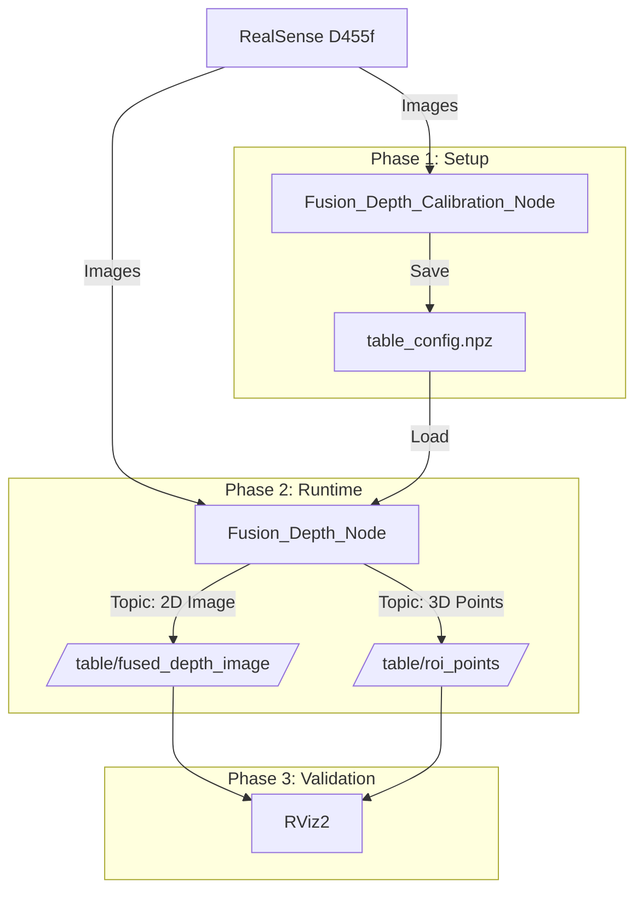

# 🚀 Robust Tabletop 3D Perception System Development Plan

## 1. 프로젝트 개요 (Overview)
* **목표:** Jetson Orin NX 환경에서 고정된 테이블 위 물체의 결측 없는(Hole-free) 3D 좌표 데이터를 실시간으로 생성.
* **핵심 기술:**
    * **Hybrid PnP:** `solvePnP`의 축 정렬 능력과 `RealSense`의 절대 거리 측정 능력을 결합한 정밀 좌표계 보정.
    * **MDE Scale Recovery:** MDE(Monocular Depth Estimation)의 형상 정보에 RealSense의 물리적 스케일을 입혀 투명/검은 물체 인식률 극대화.
* **환경:** Ubuntu 22.04 / ROS2 Humble / RealSense D455f / Headless (No GUI).

---

## 2. 시스템 아키텍처 (System Architecture)

시스템은 **설정(Calibration)** 과 **실행(Runtime)** 단계로 명확히 분리됩니다.

### 2.1 데이터 흐름도

## 3. Phase 1: 캘리브레이션 노드 개발

**Node Name:** `Fusion_Depth_Calibration_Node`

### 3.1 목적
빈 테이블 상태에서 1회 실행하여, 사용자 정의 좌표계(Table Coordinate System) 변환 행렬을 계산하고 설정 파일로 저장.

### 3.2 입력 파라미터 (ROS2 Parameters)
* `roi_corners_2d`: 이미지 상 ROI 코너 4개 픽셀 좌표 `[u, v]` (TL, TR, BR, BL 순).
* `roi_size_mm`: 실제 테이블 ROI의 가로/세로 길이 `[width_mm, height_mm]`.

### 3.3 핵심 알고리즘 (Hybrid PnP + Depth Correction)
1.  **데이터 수집:** `/camera/aligned_depth_to_color/image_raw` (Depth) 30프레임 평균 사용.
2.  **Crop & Intrinsics:** ROI 영역 Crop 및 Intrinsic($c_x, c_y$) 오프셋 보정.
3.  **SolvePnP (Pose Estimation):**
    * **2D Image Points:** 사용자 입력 코너 좌표.
    * **3D World Points:** $(0,H,0), (W,H,0), (W,0,0), (0,0,0)$ 설정.
    * **결과:** 회전($R$) 및 이동($t$) 벡터 추정.
4.  **Z-Correction (Scale Calibration):**
    * **Safe Zone(ROI 중앙)**의 RealSense 실측값($Z_{real}$)과 PnP 추정값($Z_{pnp}$) 비교.
    * 보정 계수 $\alpha = Z_{real} / Z_{pnp}$ 적용하여 $t$ 벡터 보정.
5.  **Matrix Generation:** Camera $\to$ Table 변환 행렬 $T_{4\times4}$ 생성.

### 3.4 출력 (File Save)
* **파일명:** `config/table_config.npz`
* **저장 데이터:** `crop_roi`, `intrinsics_cropped`, `T_matrix`, `safe_zone_mask`

---

## 4. Phase 2: 런타임 노드 개발

**Node Name:** `Fusion_Depth_Node`

### 4.1 목적
매장 영업 시 상시 실행되어, MDE 기반의 고품질 2D/3D 데이터를 실시간 발행.

### 4.2 초기화 프로세스
1.  `table_config.npz` 로드 및 변수 캐싱.
2.  MDE 모델(TensorRT/PyTorch) 로드.
3.  ROS2 Publisher 생성 (`/table/fused_depth_image`, `/table/roi_points`).

### 4.3 실시간 처리 파이프라인 (Loop)
1.  **Preprocessing:**
    * RGB/Depth 이미지를 저장된 ROI 좌표로 Crop.
2.  **MDE Inference (Lightweight):**
    * Crop 된 RGB 입력 $\to$ Relative Depth Map 출력.
3.  **Fusion (Scale Recovery):**
    * **Sampling:** Safe Zone 마스크 위치에서 RealSense(Metric)와 MDE(Relative) 값 추출.
    * **Regression:** 단순 선형 회귀 ($RealSense = s \cdot MDE + b$) $\to$ $s, b$ 파라미터 산출.
    * **Generation:** `Fused_Depth = MDE * s + b` (결측 없는 mm 단위 Depth 생성).
4.  **3D Transformation (Vectorized):**
    * ROI 마스크 내부 픽셀들에 대해 $P_{table} = T_{matrix} \times P_{camera}$ 연산 수행.
    * **결과:** `(N, 3)` 형태의 Point Cloud ($x, y, z$ mm 단위).

### 4.4 발행 토픽 (Outputs)

| Topic Name | Message Type | 설명 |
| :--- | :--- | :--- |
| `/table/fused_depth_image` | `sensor_msgs/Image` | MDE로 보정된 2D Depth 이미지 (RViz 시각적 검증용). |
| `/table/roi_points` | `sensor_msgs/PointCloud2` | 테이블 좌표계로 변환된 3D 점군 데이터 (frame_id: table_link). |

---

## 5. Phase 3: 검증 및 시각화 (Validation)

**Tool:** RViz2

### 5.1 검증 환경 설정
* **Global Options:** Fixed Frame = `table_link` (또는 TF 설정에 따라 `camera_link`).
* **Add Displays:** Image, PointCloud2.

### 5.2 체크리스트
**[품질] Fused Depth Image:**
- [ ] 투명한 물체나 검은 물체가 구멍(Hole) 없이 채워져 있는가?
- [ ] 물체의 경계선이 선명한가?

**[정확도] 3D ROI Points:**
- [ ] 빈 테이블일 때, 점들이 $Z=0$ 평면에 평평하게 깔리는가?
- [ ] 실제 높이 100mm 물체를 두었을 때, PointCloud 상의 Z값이 100mm 내외인가?

**[정합성] 좌표계 방향:**
- [ ] $X, Y$축 방향이 실제 매장의 테이블 가로/세로 방향과 일치하는가?

---

## 6. 개발 로드맵 (Roadmap)

- [ ] **Step 1: Calibration Node 구현**
    - solvePnP + Depth Correction 로직 작성.
    - .npz 파일 저장 기능 테스트.
- [ ] **Step 2: Runtime Node 기본 구조 작성**
    - .npz 로드 및 ROI Crop 기능.
    - MDE 없이 RealSense Raw 데이터로 PointCloud 발행 테스트.
- [ ] **Step 3: MDE 모델 연동 & Fusion 로직 구현**
    - Scale Recovery ($s, b$ 계산) 구현.
    - `/table/fused_depth_image` 발행 추가.
- [ ] **Step 4: 통합 테스트**
    - Jetson Orin NX 탑재 및 전체 파이프라인 성능(FPS) 최적화.
    - RViz2를 통한 최종 품질 승인.