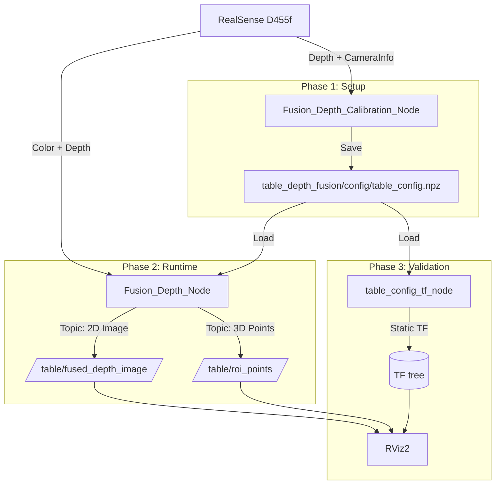

# 🚀 Robust Tabletop 3D Perception System (Current Implementation)

## 0. 저장소 구조 (ROS2 Humble Workspace 기준)
* **Workspace Root:** `enhanced_depth_ws/`
* **패키지 위치:** `src/table_depth_fusion/`
* **Python 모듈:** `src/table_depth_fusion/table_depth_fusion/`
* **노드 파일:**
    * `src/table_depth_fusion/table_depth_fusion/fusion_depth_calibration_node.py`
    * `src/table_depth_fusion/table_depth_fusion/fusion_depth_node.py`
    * `src/table_depth_fusion/table_depth_fusion/table_config_tf_node.py`
* **설정/출력 파일(패키지 기준):**
    * `src/table_depth_fusion/config/calibration_params.yaml`
    * `src/table_depth_fusion/config/runtime_params.yaml`
    * `src/table_depth_fusion/config/table_config.npz` (캘리브레이션 출력)
* **Launch 파일:**
    * `src/table_depth_fusion/launch/fusion_depth_calibration.launch.py`
    * `src/table_depth_fusion/launch/fusion_depth_runtime.launch.py`
    * `src/table_depth_fusion/launch/fusion_depth_viz.launch.py`
* **setup.py entry_points (console_scripts):**
    * `fusion_depth_calibration_node = table_depth_fusion.fusion_depth_calibration_node:main`
    * `fusion_depth_node = table_depth_fusion.fusion_depth_node:main`
    * `table_config_tf_node = table_depth_fusion.table_config_tf_node:main`

## 1. 프로젝트 개요 (Overview)
* **목표:** Jetson Orin NX 환경에서 고정된 테이블 위 물체의 결측 없는(Hole-free) 3D 좌표 데이터를 실시간 생성.
* **핵심 기술:**
    * **Hybrid PnP:** `solvePnP`의 축 정렬 능력과 RealSense의 절대 거리 측정값을 결합한 정밀 좌표계 보정.
    * **MDE Scale Recovery:** MDE(Monocular Depth Estimation)의 상대 깊이를 RealSense 물리 스케일로 정합.
* **단위 정책:** 입력 depth에 `depth_unit_scale`을 곱해 단위를 통일(현재 설정은 m 기준).
* **환경:** Ubuntu 22.04 / ROS2 Humble / RealSense D455f / Headless (No GUI).

---

## 2. 시스템 아키텍처 (System Architecture)

시스템은 **설정(Calibration)** 과 **실행(Runtime)** 단계로 분리됩니다.

### 2.1 데이터 흐름도

## 3. Phase 1: 캘리브레이션 노드 (Fusion_Depth_Calibration_Node)

### 3.1 목적
빈 테이블 상태에서 1회 실행하여, **Camera -> Table** 변환 행렬과 ROI 관련 정보를 저장.

### 3.2 입력 파라미터 (ROS2 Parameters)
* `roi_corners_2d`: 이미지 상 ROI 코너 4개 픽셀 좌표 `[u, v]` (TL, TR, BR, BL 순).
* `roi_size_m`: 실제 테이블 ROI 가로/세로 길이 `[width_m, height_m]`.
* `depth_topic`, `camera_info_topic`: 입력 토픽.
* `num_frames`: 평균을 낼 프레임 수.
* `safe_zone_margin_ratio`: Safe Zone 마진 비율.
* `depth_unit_scale`: 입력 depth 단위 변환 계수 (예: 16UC1 -> m 이면 0.001).
* `output_config`: `table_config.npz` 저장 경로.
* `exit_after_calibration`: 저장 후 자동 종료 여부.

### 3.3 핵심 알고리즘 (Hybrid PnP + Depth Correction)
1. **데이터 수집:** `/camera/aligned_depth_to_color/image_raw` 30프레임 평균.
2. **Crop & Intrinsics:**
    * ROI 코너 bbox에 **좌/우 +10px, 위 +10px, 아래 +30px** 마진 적용.
    * Crop 오프셋만큼 Intrinsic `cx, cy` 보정.
    * ROI 폴리곤 마스크 생성, Safe Zone 마스크는 ROI와 교집합.
3. **SolvePnP (Pose Estimation):**
    * 2D Image Points: 입력된 ROI 코너 좌표(크롭 좌표계로 보정).
    * 3D World Points: `(0, H, 0), (W, H, 0), (W, 0, 0), (0, 0, 0)` (단위: m).
4. **Z-Correction (Scale Calibration):**
    * Safe Zone의 RealSense 실측값 `Z_real`(median)과 PnP 추정값 `Z_pnp` 비교.
    * `scale = Z_real / Z_pnp`로 `tvec` 스케일 보정.
5. **Matrix Generation:**
    * `R, t`를 역변환하여 **Camera -> Table** 변환행렬 `T_matrix` 생성.

### 3.4 출력 (File Save)
* **파일명:** `src/table_depth_fusion/config/table_config.npz`
* **저장 데이터:** `crop_roi`, `intrinsics_cropped`, `T_matrix`, `safe_zone_mask`, `roi_polygon_mask`

---

## 4. Phase 2: 런타임 노드 (Fusion_Depth_Node)

### 4.1 목적
영업 시간 상시 실행, ROI 영역의 **Fused Depth(2D)**와 **Table 좌표계 PointCloud(3D)** 실시간 발행.

### 4.2 초기화 프로세스
1. `table_config.npz` 로드 및 캐시 (`crop_roi`, `intrinsics`, `T_matrix`, 마스크).
2. MDE 모델 로드 (onnxruntime 또는 TensorRT, `use_mde`에 따라 활성화).
3. Publisher 생성 (`/table/fused_depth_image`, `/table/roi_points`).

### 4.3 실시간 처리 파이프라인 (Loop)
1. **Preprocessing:**
    * Depth 이미지를 `crop_roi`로 Crop.
    * ROI 폴리곤 마스크를 로드하여 PointCloud 대상 픽셀 정의.
2. **MDE Inference (Optional):**
    * Crop된 RGB 입력 -> Relative Depth 출력.
    * `mde_letterbox`와 `mde_input_width/height`에 따라 리사이즈/레터박싱.
3. **Fusion (Scale Recovery):**
    * Safe Zone 마스크 위치에서 RealSense(Metric)와 MDE(Relative) 값 샘플.
    * 선형 회귀로 `RealSense ≈ s * MDE + b` 추정.
    * 샘플 부족 시 median 스케일 또는 metric depth로 fallback.
4. **3D Transformation (Vectorized):**
    * Depth와 Intrinsics로 camera 좌표 생성.
    * `T_matrix` 적용해 table 좌표계로 변환.

### 4.4 발행 토픽 (Outputs)
| Topic Name | Message Type | 설명 |
| :--- | :--- | :--- |
| `/table/fused_depth_image` | `sensor_msgs/Image` | 단위 통일된 Depth 이미지 (`32FC1`). |
| `/table/roi_points` | `sensor_msgs/PointCloud2` | Table 좌표계 점군 (`frame_id`: `table_link`). |

---

## 5. Table Config TF 노드 (table_config_tf_node)

### 5.1 목적
`table_config.npz`의 `T_matrix`를 기반으로 **Static TF**를 발행.

### 5.2 입력 파라미터
* `config_path`: `table_config.npz` 경로 (미지정 시 기본 경로 탐색).
* `parent_frame`: 기본값 `camera_color_optical_frame`.
* `child_frame`: 기본값 `table_link`.
* `translation_scale`: 변환 벡터 스케일 보정(기본 1.0, m 기준).

### 5.3 Launch
* `fusion_depth_viz.launch.py`에서 TF와 RViz2를 함께 실행.

---

## 6. 검증 및 시각화 (Validation)

**Tool:** RViz2

### 6.1 검증 환경 설정
* **Global Options:** Fixed Frame = `table_link`.
* **Add Displays:** Image, PointCloud2.

### 6.2 체크리스트
**[품질] Fused Depth Image:**
- [ ] 투명/검은 물체가 Hole 없이 채워지는가?
- [ ] 물체 경계선이 선명한가?

**[정확도] 3D ROI Points:**
- [ ] 빈 테이블일 때 점들이 `Z=0` 평면에 깔리는가?
- [ ] 실제 높이 0.10m 물체의 Z값이 0.10m 내외인가?

**[정합성] 좌표계 방향:**
- [ ] X, Y축 방향이 실제 테이블 가로/세로와 일치하는가?

---

## 7. 현재 구현 상태
- [x] Calibration node + `.npz` 저장
- [x] Runtime node (metric-only 및 MDE 기반 fusion)
- [x] Fused depth image 발행
- [x] ROI PointCloud 발행
- [x] Static TF + RViz2 시각화 런치
- [ ] Jetson 최적화/FPS 튜닝 (옵션)
